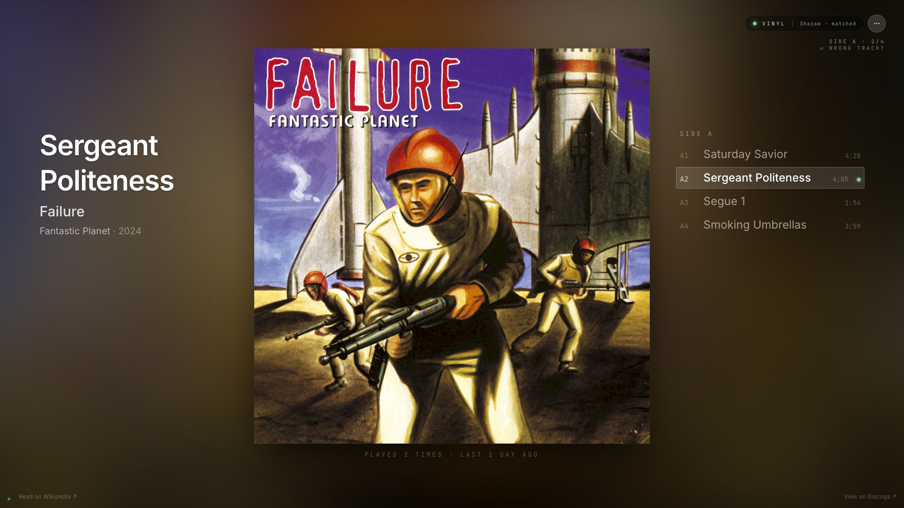
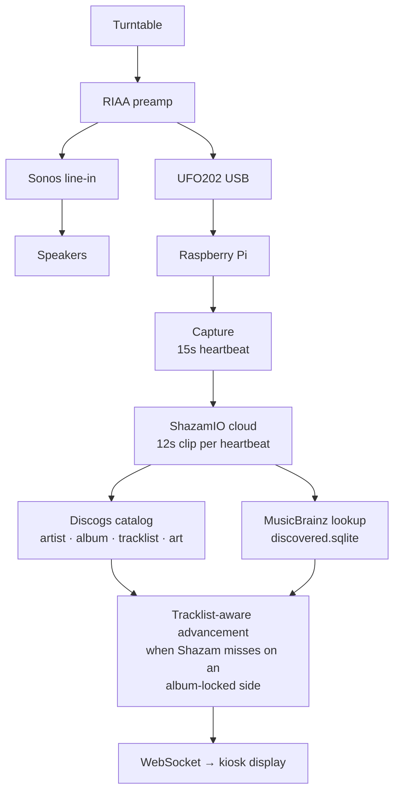

# Now Playing

> Your turntable, on a screen.

A Raspberry Pi kiosk that listens to your Sonos zone's line-in stream and identifies what's playing on your turntable — track, artist, album, side timer, canonical album art — and renders it on a wall-mounted display in real time. Built around a continuous-heartbeat audio recognition cascade that gets smarter the more you play.

## What you see



- The display shows the track currently on the turntable, with high-resolution album art.
- Drop a needle on a new track: the display updates within ~15 seconds.
- Lift the needle: the display reverts to a clock after ~50 seconds.

Most of the time the kiosk runs hands-free. When Shazam can't identify a track, the kiosk shows a **BEST GUESS card** with the predicted next track from the album's tracklist and asks you to confirm with one tap. On subsequent plays it remembers and stops asking — the system gets smarter the more you play.

The kiosk isn't vinyl-only. The Sonos zone's UPnP listener tells the orchestrator the current source — `vinyl`, `airplay`, `streaming`, `radio`, or `tv` — and each gets handled appropriately. Vinyl runs the full recognition cascade. **AirPlay without embedded metadata** (e.g., iPhone audio out to Sonos) runs through the same UFO202 + Shazam path as vinyl, so the kiosk shows what's playing even when the streamer doesn't broadcast track info. **AirPlay or Sonos streaming with embedded metadata** (Apple Music, Spotify, etc.) skips audio recognition entirely — the kiosk renders artist / album / art straight from what Sonos already knows.

Walkthrough of every kiosk state and when to tap: [`docs/USING.md`](docs/USING.md). Catalog and recognition edge cases (sample-source confusion, multi-release tracks, eponymous-LP disambiguation, off-Discogs records, pressing variations): [`docs/EDGE-CASES.md`](docs/EDGE-CASES.md).

## How it works



The Pi listens to a parallel copy of the line-in signal (Sonos plays it aloud; the UFO202 sends it to the Pi). Every 15 seconds while there's signal above the silence floor, a 12-second clip is sent to Shazam. The recognized release is reverse-looked-up against your local Discogs collection first; when there's no Discogs match (a record you don't own, or you skipped the Discogs sync) the orchestrator falls back to a MusicBrainz lookup that persists the release + tracklist into a parallel `discovered.sqlite`. Either path produces the same album-context surface: art, tracklist, side timer, BEST GUESS card. When Shazam can't identify a track on the locked album, the orchestrator advances through the locked tracklist and publishes a predicted track so the kiosk keeps showing useful info instead of dropping to "couldn't identify."

## Hardware bill of materials

| Component | Notes |
|---|---|
| Raspberry Pi 4 (4GB+) or Pi 5 | Tested on Pi 4 with Pi OS Trixie / Bookworm |
| 16+ GB microSD card | A2 / U3 class |
| USB audio interface | Behringer UFO202 tested; any stereo USB-in works (you may need to edit `find_ufo202`) |
| Kiosk display | HDMI or DSI; AMOLED panels look best for album art |
| Turntable + RIAA pre-amp | Anything line-level into Sonos |
| RCA splitter | Sends one signal to both Sonos and the UFO202 |
| Sonos zone configured for line-in | Existing Sonos setup |

## External requirements

Which services and accounts the kiosk relies on, and what you lose by skipping the optional ones. The full source-of-truth template is [`pi/.env.example`](pi/.env.example) — every variable below has an entry there with a matching comment.

| Service | Mechanism | Status | What you lose without it |
|---|---|---|---|
| Sonos | `SONOS_ZONE_NAME` (default `Office`) — soco library, no key | Required | Nothing fancy needed; the listener needs a Sonos zone with line-in selected. Set the env var when you have multiple coordinators and want to pin one. |
| Discogs | `DISCOGS_TOKEN` + `uv sync --extra discogs` | Recommended | Pressing-accurate metadata for the records you actually own: your specific edition's tracklist and cover scans, the `/identify` manual-pick flow against your collection, and stronger disambiguation when a track appears on multiple releases you own. Without it the album-context layer still works — releases are auto-discovered from MusicBrainz on first play and persisted to `discovered.sqlite`, with album art from Shazam's Apple CDN / Cover Art Archive — but you get MusicBrainz's canonical release rather than your specific pressing. |
| MusicBrainz / Cover Art Archive | no key — hardcoded User-Agent per MusicBrainz TOS | Built-in | Album-art lookups and the no-Discogs discovery path (auto-populates `discovered.sqlite` so off-Discogs records still get album context, tracklist, side timer, BEST GUESS card, and the local fingerprint cascade). Not user-configurable. |
| ShazamIO | no key — `uv sync --extra shazam` | Required | Track recognition. Without it the kiosk has no cloud identifier and the cascade has nothing to work with. |
| Last.fm scrobbling | `LASTFM_API_KEY` + `LASTFM_API_SECRET` + `LASTFM_SESSION_KEY` | Optional | Auto-scrobbling of confirmed tracks (≥30s, ≥50% played or ≥240s). The kiosk works identically without it; nothing is sent to Last.fm. |
| Kiosk bind addr/port | `NP_HOST` (default `0.0.0.0`) / `NP_PORT` (default `8080`) | Optional | Nothing — defaults are correct for the standard systemd install. Override only if running on a non-default port or binding to a specific interface. |
| LLM assist (Haiku) | `ANTHROPIC_API_KEY` + `uv sync --extra llm` | Optional | Hardcoded heuristics at four cascade decision points (cover/tribute filter, end-of-side advance, /identify release ranker, fingerprint promotion gate) instead of LLM-judged decisions. The kiosk works identically without it; the LLM hooks fall back to today's rules. |
| Local fingerprint fallback | `FINGERPRINT_ENABLED=true` + `uv sync --extra fingerprint` | Optional | Passive auto-promotion of every Shazam-confirmed clip into a local fingerprint DB, and a local recognition fallback on Shazam misses for albums you've already played. Without it, Shazam misses on a locked album fall through to tracklist-aware advancement (today's behavior). |

## Get started

**Full setup walkthrough:** [`docs/INSTALL.md`](docs/INSTALL.md) — hardware wiring, OS prep, Sonos/Discogs setup, services, troubleshooting. Plan on 60–90 minutes for a first install.

For experienced installers:

```bash
git clone <repo-url> ~/now-playing
cd ~/now-playing/pi
curl -LsSf https://astral.sh/uv/install.sh | sh && exec $SHELL
uv sync --extra audio --extra discogs --extra shazam
# create .env (in this directory) with DISCOGS_TOKEN and SONOS_ZONE_NAME, then:
uv run python scripts/discogs_sync.py
cd ~/now-playing && sudo bash pi/systemd/install.sh
```

Open `http://<pi-hostname>.local:8080/` in a browser.

### Ask Claude

The repo ships with a Claude Code skills bundle under `.claude/skills/` that activates when you `cd` into the project (requires [Claude Code](https://claude.com/claude-code) installed locally):

- *"Help me set this up"* → guided install walkthrough
- *"The orchestrator service won't start"* → systematic troubleshooting
- *"What's playing right now?"* → live state query
- *"Show me recent recognitions"* → read-only runtime inspection

No explicit invocation needed; describe the situation and the relevant skill activates.

## Scope

**Core (always on):**
- Sonos zone discovery + state tracking via UPnP (soco + events_asyncio)
- Continuous heartbeat audio capture (UFO202, 15s cadence, -15 dB silence floor)
- Shazam-first recognition with Discogs catalog enrichment when available; MusicBrainz-driven album discovery for off-Discogs records (persisted to `discovered.sqlite`)
- Tracklist-aware advancement: when Shazam misses on an album-locked side, the orchestrator predicts the next track from the locked album's tracklist
- Local fingerprint cascade for both Discogs and MusicBrainz-discovered releases — passively trained from confirmed Shazam hits
- 45-second idle timer → kiosk reverts to clock when playback stops
- WebSocket push to the kiosk; React + Vite display with smooth crossfades
- systemd services with restart-on-crash, journald integration, bounded memory
- Touch UI on the kiosk for "wrong track" / manual identification

**Optional (env-gated):**
- Last.fm scrobbling for confirmed plays
- Local fingerprint fallback (passively trained from Shazam-confirmed clips; identifies tracks Shazam misses on albums you've already played)
- LLM-assisted cascade decisions (Anthropic Haiku at four hook points)

## Project layout

- `pi/` — Python orchestrator (Sonos listener + audio capture + recognition + WebSocket server)
- `kiosk/` — React + Vite display, served by the orchestrator's HTTP server
- `pi/systemd/` — service unit templates + installer script
- `.claude/skills/` — project-local Claude Code skills bundle
- `docs/INSTALL.md` — end-to-end install walkthrough
- `docs/ARCHITECTURE.md` — technical reference for every mechanism in the pipeline

## Acknowledgments

Built on the work of others:

- **[ShazamIO](https://github.com/shazamio/ShazamIO)** — async wrapper around Shazam's identification service; the primary recognizer for vinyl tracks.
- **[soco](https://github.com/SoCo/SoCo)** + events_asyncio — Sonos UPnP control without official API access.
- **[python3-discogs-client](https://github.com/joalla/discogs_client)** — catalog metadata, tracklists, and cover scans.
- **[MusicBrainz](https://musicbrainz.org/)** + **[Cover Art Archive](https://coverartarchive.org/)** — live album-art lookups; the source of every cover the kiosk renders.
- **[Last.fm](https://www.last.fm/api)** — scrobbling for confirmed plays (optional).
