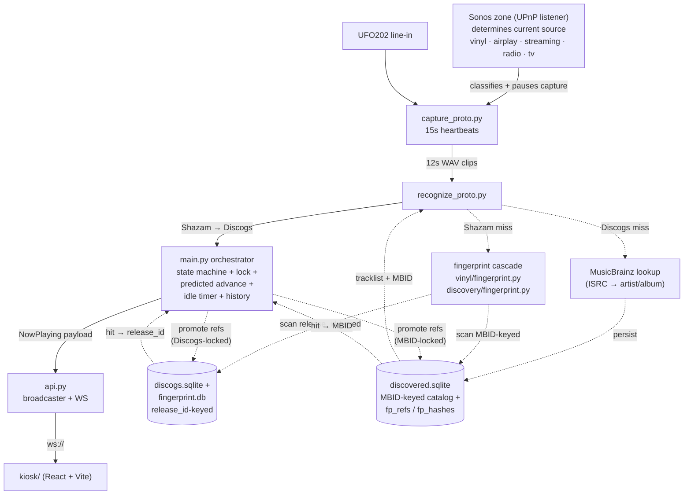

# Now Playing — Architecture Reference

A cheat-sheet of every mechanism in the pipeline. A **reference card**,
not prose. Each entry is named, located by `file:line` for grep, and
described in one sentence. When in doubt, follow the citation.

## System map



## Capture layer — `pi/scripts/capture_proto.py`

Block-level loop reading the UFO202 USB audio device. Every 50 ms
block goes into a rolling buffer + RMS window. Heartbeats emit clips;
silent/audible IPC events drive orchestrator state transitions.

| Mechanism | Location | One-liner |
|---|---|---|
| Silence floor | `capture_proto.py:84` | RMS below this is silence; heartbeats suppressed. Default `-15 dB`. Ambient line-in noise floor on UFO202+preamp sits around -17 dB; real music is -0.5 to -10 dB. -15 separates them with ~2 dB clearance above ambient and 5+ dB below the quietest expected music signal. |
| Heartbeat cadence | `capture_proto.py:89` | Seconds between heartbeat clip writes. Default `15s`. Must match `HEARTBEAT_INTERVAL_S` in `main.py`. |
| Silent timer | `capture_proto.py:91` | Sustained silence before emitting `silent` IPC. Default `5s`. |
| Audible debounce | `capture_proto.py:93` | Suppress repeat `audible` events within this window unless a sustained `silent` fired in between. Default `30s`. Prevents Honey-Pie-style threshold flap from resetting per-side state. |
| Rolling buffer | `capture_proto.py:100` | Duration of WAV clip written each heartbeat. Default `12s`. **Hard ceiling at 14s** — Shazam's backend silently returns empty matches at ≥15s ([shazamio Issue #150](https://github.com/dotX12/ShazamIO/issues/150)). 12s = 2s of safety pad. |
| Resume-music threshold | `capture_proto.py:107` | After a silent period, force-emit first heartbeat as soon as level rises above this. Default `-28 dB`. Lands the post-silence clip at song-start instead of waiting for the cadence tick. |
| Instant-clip delay | `capture_proto.py:46` | Seconds after silent→audible to flush a one-shot clip. Default `3s`. 12s buffer at that moment covers ~t=-9..+3 of the new song — enough for Shazam within 2–5s of needle drop. |
| Fast-heartbeat window | `capture_proto.py:47` | Drop cadence to `--fast-heartbeat-s` for this duration after audible. Default `30s` with `--fast-heartbeat-s 5s`. Extra song-start shots for Shazam. |
| Was-below-floor flag | `capture_proto.py:151` | Single-block-granularity dip detector. Any block below floor flips this true; the next above-floor block fires `audible` IPC. Catches fast side-flips that never accumulate to `--silent-s` of sustained silence. |
| SIGHUP / SIGCONT | `capture_proto.py:183, 199` | Orchestrator pauses/resumes clip writes when Sonos source isn't vinyl/AirPlay-without-metadata. Audio stream + silent events keep running for instant resumption. |
| SIGUSR1 / SIGUSR2 | `capture_proto.py:197, 207` | Runtime-mutable heartbeat cadence override. Used by the "anticipated track end" mechanism (currently visually suppressed). |

## Recognition cascade — `pi/scripts/recognize_proto.py`

Per-clip recognizer. Single Shazam tier, calls out to the local Discogs
catalog for enrichment, with a parallel discovered-catalog (MusicBrainz)
fallback for releases not in the user's Discogs collection.

| Mechanism | Location | One-liner |
|---|---|---|
| Shazam tier | `recognize_proto.py:49–109` | ShazamIO call (~1–2s round-trip). Clip must be <14s. On hit: artist + title → `catalog.find_by_artist_title(preferred_release_id=...)`. |
| `preferred_release_id` plumbing | `recognize_proto.py:52, 91` | Sticky lock. Orchestrator passes `state.last_vinyl["release_id"]`; catalog uses it for the +25 disambiguation bonus. |
| Shazam-only payload enrichment | `recognize_proto.py:125–130` | When Discogs misses, propagate Shazam-derived `album`, `art_url`, and `albumadamid` onto the payload so the kiosk renders more than artist+title. |
| `_attach_discovered_or_schedule` | `recognize_proto.py:149` | If `discovered.sqlite` already has a release for (artist, album), attach `release_mbid` + `tracklist` + resolved `track_position`/`side`; otherwise fire `_schedule_discovery` background task. |
| `_resolve_track_position` | `recognize_proto.py:202` | Match Shazam track title against discovered tracklist (exact preferred, single-substring fallback). Fail-open on ambiguity. |
| `_find_matching_track` | `recognize_proto.py:183` | Returns `(exact, fuzzy)` lists. Substring matches both directions (handles `"Tighten Up (Live)"` vs `"Tighten Up"`). |
| `_schedule_discovery` | `recognize_proto.py:228` | Fire-and-forget MB lookup (ISRC first, then artist/album). Per-(artist, album) lock prevents duplicate in-flight requests across heartbeats. |

## Orchestrator state — `pi/nowplaying/main.py`

The brain. State machine owning `last_vinyl` (the confirmed lock),
`predicted_position` (tracklist-aware fallback), streak counters,
idle timer, and shazam-only cross-heartbeat agreement.

### State fields — `main.py:97`

| Field | Purpose |
|---|---|
| `sonos_source` | Current Sonos source ("vinyl" / "airplay" / "streaming" / "radio" / "tv" / "unknown"). Gates capture state handlers. |
| `sonos_state` | "PLAYING" / "PAUSED" / "STOPPED". |
| `last_vinyl` | Last confirmed recognition payload. The "album lock." Survives Sonos volume events that publish empty metadata. |
| `idle_task` | `asyncio.Task` for the 45s post-silence idle timer. Cancelled on any music-level heartbeat or audible. |
| `pending_shazam_only` | Recent Shazam hits without a Discogs match. Cross-heartbeat agreement gate (MIN_AGREEMENTS=2, PENDING_WINDOW_S=120s) before publishing. |
| `sonos_has_metadata` | True if Sonos zone returned DIDL metadata. Distinguishes vinyl-with-metadata-from-AirPlay-renaming vs vinyl-direct. |
| `capture_emit_paused` | True after SIGHUP. Capture stream runs but clips aren't written. |
| `unmatched_streak` | Consecutive unmatched heartbeats. Drives NEEDS_ID transition (≥2) and idle-timer escalation (≥4). |
| `track_started_at` | ISO-8601 timestamp anchored at most recent identity change. Back-dated via `RECOGNITION_LEAD_S` for client elapsed-clock alignment. |
| `last_published_identity` | `(artist, title, track_position)` tuple of the last publish. Used to detect "actually changed" vs "same track re-confirmed." |
| `predicted_position` | Tracklist-aware advancement state `{release_id, side, track_position, index_in_side}`. **Separate from `last_vinyl`** so a Shazam miss never pollutes the confirmed lock. |
| `user_track_pin` | When the user manually picks a track via "Wrong Track" / `/identify`, the pinned identity is recorded here and **honored** in subsequent heartbeats until a release condition fires. Replaces the deleted album-lock mechanism that previously made manual picks stick. Shape: full payload identity (release_id, artist, album, title, track_position, side, art_url, duration_seconds, tracklist) plus `pinned_at_mono` for TTL. |
| `pin_different_track_streak` | Consecutive Shazam hits on a different track within the pinned release. Reaches `PIN_DIFFERENT_TRACK_RELEASE_STREAK = 3` → pin released (the user moved past their pinned track). |

### Key constants — `main.py:60–197`

| Constant | Value | Purpose |
|---|---|---|
| `NEEDS_ID_STREAK` | `2` | Music-level unmatched heartbeats before kiosk drops to NEEDS_ID. |
| `MAX_UNMATCHED_STREAK` | `4` | Music-level unmatched heartbeats before treating as silence + arming idle. |
| `SHAZAM_ONLY_MIN_LEVEL_DB` | `-12 dB` | "Music level" gate. Distinguishes real music (-1 to -10 dB) from threshold-edge ambient noise (-15 to -16 dB). 3 dB clearance above ambient, inclusive of quietest expected music intros. |
| `HEARTBEAT_INTERVAL_S` | `15` | Capture cadence (must match `--heartbeat-s` in capture). Used by streak-seeded prediction back-date math. |
| `PIN_DIFFERENT_TRACK_RELEASE_STREAK` | `3` | Consecutive Shazam hits on a different position within the pinned release before the pin auto-releases. |
| `PIN_TTL_BUFFER_S` | `15` | Pin TTL = `duration_seconds + PIN_TTL_BUFFER_S` (when duration known). Null duration → no TTL. |

### Recognition lead-time map — `main.py:171–183`

```python
RECOGNITION_LEAD_S = {
    "shazam": 12,          # capture buffer (~12s) + Shazam round-trip
    "predicted": 2,        # fires on audible edge, same as Sonos events
    "sonos-didl": 2,       # UPnP event dispatch latency
    "sonos-polled": 2,
}
```

Back-dates `track_started_at` so client elapsed-time clocks line up with
audio. The streak-seeded predicted path (`main.py:469`) computes a custom
back-date of `NEEDS_ID_STREAK * 15 + 2 = 32s` because by the time the
streak threshold trips, the song has actually been playing ~30s.

### `on_heartbeat` branching — `main.py:286–680`

1. **Capture-pause guard**. Pause if source isn't vinyl or AirPlay-without-metadata.
2. **Idle retraction**. Music-level heartbeat cancels in-flight idle task.
3. **Recognize call**. Passes `preferred_release_id` from `last_vinyl`.
4. **Unmatched branch**:
   - `streak < NEEDS_ID_STREAK` → wait silently.
   - `last_vinyl + predicted_position` set → **re-publish current prediction** (extends history row).
   - `streak == NEEDS_ID_STREAK` AND lock → **seed prediction** via `_try_advance_prediction` with back-dated `track_started_at`. Falls through to NEEDS_ID if end-of-side.
   - `streak > NEEDS_ID_STREAK` and no prediction → "still in NEEDS_ID, no republish."
   - Original NEEDS_ID publish (no lock or end-of-side): kiosk shows "couldn't identify."
   - Below-music-level + `last_vinyl` set: escalate to idle after `MAX_UNMATCHED_STREAK`.
5. **User-track-pin honor path** — `main.py:657–680`. **Runs BEFORE the unconditional `state.last_vinyl = payload` overwrite.** When the user has pinned a track via `/identify`, every subsequent Shazam hit is evaluated against the pin via `_evaluate_user_pin`. Returns `("honor", ...)` → patch the outgoing payload with the pinned identity. Returns `("clear", ...)` → release pin and proceed normally. Returns `("pass", ...)` → no pin active, normal flow.
6. **Confirmed match**. Resets `unmatched_streak` and `predicted_position`. If `release_id is None` (Shazam hit, no Discogs match), gates on cross-heartbeat agreement.

### `on_capture_state` handlers — `main.py:568–650`

| Event | Behaviour |
|---|---|
| `silent` | Clear `predicted_position`. Arm idle timer (45s) unless one's already running. |
| `audible` (album-locked) | Cancel in-flight idle. Try to advance prediction (`_try_advance_prediction`). Publish predicted track. |
| `audible` (no lock) | Cancel idle. Publish VinylIdentifying spinner. Reset `unmatched_streak = 0`. |

### Prediction helpers — `main.py:109–246` (module-level)

| Function | Purpose |
|---|---|
| `_advance_predicted_position(tracks, current)` | Pure: find current's index within its side; return next index or `None` at end-of-side. |
| `_build_predicted_payload(last_vinyl, predicted, source)` | Pure-ish: look up track via `discogs_catalog.get_release`, merge album fields from `last_vinyl` + track fields from catalog, return payload with `match_method: "predicted"`, `predicted: True`. |
| `_try_advance_prediction` (closure) | Orchestrator method: pick source position (existing prediction or seed from `last_vinyl`), advance, publish, record history. Accepts `track_started_at_override` for streak-seed back-dating. |
| `_republish_current_prediction` (closure) | Re-emit current prediction without advancing. Used when streak persists past NEEDS_ID_STREAK. |

### User-pin helper — `main.py:200–250`

`_evaluate_user_pin(pin, streak, rid, position, now_mono)` returns `("pass" | "honor" | "clear", new_streak, reason)`. Pure function — easy to unit-test (see `pi/tests/test_user_track_pin.py`, 18 cases). Release conditions in evaluation order:

1. **TTL expiry** — `pinned_at_mono + duration_seconds + PIN_TTL_BUFFER_S < now_mono`. Null duration → TTL skipped.
2. **Different `release_id`** — Shazam hit on a different album entirely.
3. **Different-position streak** — 3 consecutive Shazam hits on a different position within the pinned release (user moved past the pinned track).
4. **Source flip, idle, or NEEDS_ID transition** — pin cleared by `on_capture_state` / idle-timer fire / NEEDS_ID publish branches.

Shazam-only hits (`release_id is None`) are honored unconditionally — that's exactly the case where the user's catalog pick is most authoritative.

### Idle timer — `main.py:550`

45-second `asyncio.sleep`, cancellable. On fire: clear `last_vinyl`,
`predicted_position`, `pending_shazam_only`, publish `STOPPED`.

## Discogs disambiguation — `pi/nowplaying/discogs/catalog.py`

When Shazam returns a track title, the catalog picks which release in
the user's collection it belongs to.

### `find_by_artist_title(artist, title, preferred_release_id=None)` — `catalog.py:289`

Public wrapper. Calls `_find_by_artist_title_primary` first; on `None`,
falls back to **slash-split**: if the raw `title` contains ` / ` (medley
notation from Shazam, e.g. `"Changeling / Transmission"` for *The Private
Press*), split on the first ` / ` and try each half recursively through
the public wrapper. Three-half medleys (`"A / B / C"`) cascade naturally
because the recursive call re-enters the same wrapper. Tie-break: higher
`match_score` wins, first half wins on equal scores. Slash detection
runs on raw title (not normalized — `_normalize` strips `/` to whitespace).

### `_find_by_artist_title_primary` — `catalog.py:355`

Two-pass scoring. Pass 1: candidate filtering by similarity threshold.
Pass 2: bias application + winner selection. Returns winner + up to 5
alternates.

| Score component | Magnitude | Notes |
|---|---|---|
| Base | `100 * (0.3 * artist_sim + 0.65 * track_sim)` | 30% artist, 65% track-title weight. Token Jaccard + character-similarity, take max. Filters: `artist_sim < 0.5` OR `track_sim < 0.7` → reject. |
| Sticky preferred-release | `+25` | When candidate's `release_id == preferred_release_id`. Large enough to flip ties; not large enough to override a genuinely better candidate. |
| Side-first | `+15` | First track on its side (rowid-aware via `first_position_per_side` query — see below). |
| Compilation penalty | `-3` | Tiebreaker only. Detected via "Compilation" format tag, compilation keywords, or year-range pattern. |
| Anthology side-deep | `+0` (filter) | Deep sides (E+) get filtered out of alternates list, not score-penalized. |
| Year tie-breaker | — | Sort `(score, year)` descending. Most recent pressing wins ties. |

### Side-first helpers — `catalog.py:56–96`

| Function | Purpose |
|---|---|
| `first_position_per_side(release_id)` | LRU(512). Returns `{side: first-position}` by querying `tracks ORDER BY rowid`. Discogs sync inserts tracks in physical play order; rowid preserves it. Both per-side ("D1") and cumulative ("D15") numbering work. |
| `_is_side_first_track(release_id, position)` | Looks up `first_position_per_side` and compares case-insensitively. Rowid-aware so cumulative numbering doesn't penalize multi-LP releases. |
| `get_release(release_id)` | Returns release dict including `tracks` list. Tracks are `ORDER BY position` (lexicographic — display order in kiosk, not physical order). |
| `rid_to_album(release_id)` | LRU(512). Returns `(artist, title)`. Used by art proxy. |

### Alternates — `catalog.py:397`

Returns up to 5 distinct releases whose base-without-sticky score is
within `ALTERNATE_DELTA = 20` of the winner. Sticky bonus is NOT
applied to alternates — so the alternates list represents "what would
have won without the lock," which is what the user needs to see to
correct a wrong album choice.

## Catalog dispatch — `pi/nowplaying/catalog/__init__.py`

Thin dispatcher in front of `nowplaying.discogs.catalog` and
`nowplaying.discovery`. Callers pass `release_id` (Discogs) **or** `mbid`
(discovered) and the dispatcher routes to the right store, returning a
release dict in a shape both paths share. When both IDs are passed,
Discogs wins (canonical pressing).

| Entrypoint | Location | Routing |
|---|---|---|
| `get_release(release_id=None, mbid=None)` | `catalog/__init__.py:23` | `release_id` set → `discogs_catalog.get_release`; else `mbid` → `_get_discovered_release` (queries `releases` + `tracks` ORDER BY rowid). |
| `first_position_per_side(release_id=None, mbid=None)` | `catalog/__init__.py:40` | Either backend returns `{side: first-track-position}`. Discovered path queries `tracks` ORDER BY rowid; first row per side wins. |
| `rid_to_album(release_id=None, mbid=None)` | `catalog/__init__.py:52` | Returns `(artist, title)` for either ID, or `None`. |

## Discovery layer — `pi/nowplaying/discovery/`

MBID-keyed parallel to the Discogs collection. Populated from MusicBrainz
at recognition time when Shazam confirms a release that isn't in the
user's Discogs catalog.

### Schema — `pi/data/discovered.sqlite`

Defined in `discovery/schema.py` (`DISCOVERED_DB_PATH`, `init_db`,
`open_ro`, `open_rw`). WAL mode + `foreign_keys=ON`.

| Table | Columns | Purpose |
|---|---|---|
| `releases` | `mbid TEXT PK, artist, title, year, art_url, discogs_release_id, discovered_at, normalized_album` | Per-MBID metadata. `normalized_album` migration runs on every `init_db` (backfills with `LOWER(TRIM(title))`). |
| `tracks` | `mbid FK, position, side, title, duration_seconds, PRIMARY KEY (mbid, position)` | Tracklist. Insert order preserved via rowid for side-first queries. |
| `negative_lookups` | `artist_norm, album_norm, stamped_at` | Caches MB misses so a known-unfindable album doesn't refire every heartbeat. |
| `fp_refs` | `id PK, mbid, track_position, track_position_s, created_at, UNIQUE(mbid, track_position, track_position_s)` | MBID-keyed fingerprint references, parallel to `fingerprint.db:fp_refs`. |
| `fp_hashes` | `hash, ref_id FK, offset` | Hash → ref index, parallel to `fingerprint.db:fp_hashes`. |

### `discovery/musicbrainz_lookup.py`

| Function | Location | Purpose |
|---|---|---|
| `lookup_by_isrc` | `musicbrainz_lookup.py:134` | ISRC → release MBID via MB recording search → release pick. Strongest signal; tried first. |
| `lookup_by_artist_album` | `musicbrainz_lookup.py:255` | Artist + album fallback. Track-count-aware MBID resolver (reused from `coverart.py`) to disambiguate when multiple releases share the title. Stamps `negative_lookups` on miss. |
| `persist` | `musicbrainz_lookup.py:334` | Async wrapper around `_persist_sync`. Inserts release row + tracks + sets `normalized_album = normalize_album(title)`. |
| `find_discovered_release_by_artist_album` | `musicbrainz_lookup.py:387` | Local DB lookup keyed on `LOWER(artist)` + `normalize_album(album)`. Returns MBID or `None`. No network. |

### `discovery/_normalize.py`

| Function | Location | One-liner |
|---|---|---|
| `normalize_album` | `_normalize.py:44` | Lower-cases + trims, then strips keyword-gated parenthesized edition markers (`"(Deluxe Edition)"`, `"(Remastered)"`, `"(Anniversary Edition)"`, etc.). Non-edition parens (`"Live at Leeds"`) are kept. |
| `normalize_artist` | `_normalize.py:69` | Case + whitespace only — artist names are too varied for keyword stripping. |

### Fingerprint cascade dispatcher — `pi/nowplaying/orchestrator/_heartbeat_handlers.py`

| Mechanism | Location | One-liner |
|---|---|---|
| `_cascade_match_dispatch` | `_heartbeat_handlers.py:51` | Routes a fingerprint match by lock shape. `release_id` set → scoped scan of `fingerprint.db`. `release_mbid` set → scoped scan of `discovered.sqlite`. Both `None` (blind) → unioned scan across both stores, results merged + sorted by `Hit.hits` so the strongest cross-store hit wins. |
| `Hit` NamedTuple | `vinyl/fingerprint.py:70` | Widened: `release_id: int | None`, `mbid: str | None`. Discogs hits set `release_id`; discovered hits set `mbid`. Exactly one is always populated. |

### `discovery/fingerprint.py`

MBID-keyed parallel to `vinyl/fingerprint.py`. Reuses the same hashing +
alignment-scoring helpers (`_fingerprint`, `_score_ref_alignments`) so
the algorithm is identical across both stores.

| Function | Location | Purpose |
|---|---|---|
| `add_ref(mbid, track_position, track_position_s, wav_bytes)` | `discovery/fingerprint.py:78` | Insert one fp_ref + its hashes for a discovered release. Idempotent via the `UNIQUE(mbid, track_position, track_position_s)` constraint. |
| `match(wav_bytes, mbid_or_none)` | `discovery/fingerprint.py:178` | Scoped (`mbid` set) or blind (`None`) match. Returns `[Hit(...)]` sorted by `Hit.hits` descending. |
| `delete_refs(ref_ids)` | `discovery/fingerprint.py:212` | Cascade-deletes hashes via FK. Used by hygiene. |

### Promotion routing — `orchestrator/_heartbeat_handlers.py:_schedule_coverage_promotion`

`_schedule_coverage_promotion` (`_heartbeat_handlers.py:699`) routes
MBID-anchor coverage gaps to `discovery.fingerprint.add_ref`
(`_heartbeat_handlers.py:773–784`). MBID-keyed promotion bypasses the
Discogs-cohort gates (cross-cohort guard + spacing/cap are `release_id`-keyed
in `vinyl.promotion`); the `UNIQUE` constraint on
`discovery.fingerprint.fp_refs` is the only gate against duplicate writes,
which is sufficient given today's anchor-only discovered-promotion flow
(no user-pin on discovered releases yet). The `release_id` branch is
unchanged.

## History — `pi/nowplaying/history.py`

SQLite-backed play log. Coalesces same-track heartbeats into one row.

| Mechanism | Location | Notes |
|---|---|---|
| `COALESCE_WINDOW_S` | `history.py:81` | `60s`. Heartbeats within this window of the previous row's `ended_at` extend it instead of inserting a new row. |
| Row-match wildcard | `history.py:130–156` | Title is the strong key. release_id / artist / album / track_position match wildcardly (None → value enrichment doesn't split plays). |
| Album session gap | `history.py:82` | `30 min`. Gap >30m between same-release rows starts a new session. |
| Method upgrade | `history.py:201–224` | `CONFIRMED_METHODS = (shazam, sonos-*, user-*)` always overwrite predicted/unmatched in the UPDATE. Predicted entries become Shazam-confirmed when Shazam catches up. |

## Rate limit — `pi/nowplaying/vinyl/ratelimit.py`

Process-local circuit breaker around Shazam. Single-process so no
cross-worker coordination; resets on restart.

| Threshold | Default | Behaviour |
|---|---|---|
| Soft cap | `20 / min` | Log WARNING but allow. |
| Hard cap | `30 / 120s` rolling window | Trip circuit immediately. |
| Trip duration | `300s` → `2x` → max `1800s` | Initial 5min, doubles per re-trip, capped at 30min. |
| Backoff | `1s` initial, cap `60s` | Exponential `2^(consecutive_failures-1)` for transient failures. |
| 429 handling | Immediate trip | HTTP 429 from endpoint trips regardless of attempt count. |

## Publish + WebSocket — `pi/nowplaying/api.py`

| Mechanism | Location | One-liner |
|---|---|---|
| `_anchor_and_publish` | `main.py:288–322` | Sonos-supplied `track_started_at` adopted verbatim on track change; others back-dated via `RECOGNITION_LEAD_S[match_method]`. |
| Broadcaster `_last` cache | `api.py:36, 52` | New WebSocket clients immediately get the most recent payload without waiting for the next publish. |
| `/art/<release_id>` | `api.py:419` | Async art proxy. MusicBrainz CAA lookup if not cached. |
| `/api/album-context` | `api.py:424` | Hint-gated MusicBrainz lookup for canonical artist + album resolution. |

### NowPlaying payload — `pi/nowplaying/vinyl/runtime.py:to_now_playing_vinyl`

Discogs-hit payloads still carry `release_id` + Discogs-derived `art_url`
(via `_art_url_for_release`). Discovered-hit payloads carry additional
fields so the kiosk can render without a Discogs match:

| Field | Source | Notes |
|---|---|---|
| `art_url` | `runtime.py:370–377` | Discogs path: `/art/<release_id>` proxy URL. Shazam-only path: wrapper-extracted Shazam art URL. |
| `release_mbid` | `runtime.py:380–381` | Set when discovered.sqlite resolved the (artist, album). Drives the catalog dispatcher + MBID-keyed fingerprint scan. |
| `albumadamid` | `runtime.py:382–383` | Shazam Apple Music album ID. Propagated for downstream enrichment / future Apple Music lookups. |

## Kiosk UX — `kiosk/src/`

### Now-playing display

| Mechanism | Location | One-liner |
|---|---|---|
| Release-id-keyed art identity | `NowPlaying.tsx:21–29` | Art identity is `release_id` (shared across tracks on same album), so consecutive tracks don't refetch. |
| Pre-warm image cache | `NowPlaying.tsx:61–69` | New `Image()` fires on release-id change to pre-fetch `/art/<id>` before AlbumArt mounts. |
| Track identity split | `NowPlaying.tsx:37–41` | TrackInfo animates on every track change; AlbumArt stays mounted until release changes. |
| Source-badge rules | `NowPlaying.tsx:145–156` | Color dot + method label. Hidden when idle. |
| Predicted italic | `TrackInfo.tsx:27–29` | `data.predicted === true` → italic title at 85% opacity. No badge. |
| Display-mode hierarchy | `NowPlaying.tsx:71–85` | Priority: idle → NEEDS_ID → AirPlay → VinylIdentifying → Track. |

### Album art

| Mechanism | Location | One-liner |
|---|---|---|
| Double-layer fade | `AlbumArt.tsx:43–78` | Old layer demoted to `previous`, new layer hidden until `onLoad`. |
| ONLOAD_TIMEOUT | `AlbumArt.tsx` | Force-visible at 2s if `onLoad` doesn't fire (don't hold stale art forever). |
| 404 retry schedule | `AlbumArt.tsx:99–112` | `[5s, 15s, 30s]` backoffs with `?v=attempt` cache-bust query. MusicBrainz lookup is async. |

### /identify search

| Mechanism | Location | One-liner |
|---|---|---|
| Token-match autopilot | `Identify.tsx:79–118` | If query matches a track title, auto-expand the album and highlight the track. |
| Autopilot guard | `Identify.tsx:91–104` | Skip autopilot if query matches an artist or album name — "Failure" shouldn't jump into ATUM. |
| Hoist-expanded | `Identify.tsx:340–353` | When an album expands, move it to the top of its group so its tracklist isn't below alphabetical siblings. |
| Scroll-into-view | `Identify.tsx:566–574` | Delay 260ms past Framer Motion transitions, then scroll the expanded card to top. |
| Album-pick one-tap | `Identify.tsx:306–315` | `?scope=album` mode. Tapping any album auto-resolves the matched track and submits — no second pick. |
| Track highlight (in-place) | `Identify.tsx:677–679` | Matched tracks render with amber border + position color. Stays in natural tracklist order (no reorder). |
| Search clear button | `Identify.tsx:~408` | 44×44 round × button absolutely positioned inside the search input. Visible whenever the input has text. |
| Debounce | `Identify.tsx:169–172` | `200ms` after last keystroke. Clears album-pick mode. |
| ?scope=track\|album prefill | `Identify.tsx:178–231` | URL param prefills search. `scope=album` builds `<artist> <title>` and skips autopilot. |

### NEEDS_ID

| Mechanism | Location | One-liner |
|---|---|---|
| Simplified clip-less state | `NeedsIdScreen.tsx` | No clip queue. Shows previous-track context + "Help identify this song" link to `/identify`. |

### WebSocket + state

| Mechanism | Location | One-liner |
|---|---|---|
| Exponential reconnect | `useNowPlaying.ts:48–52` | `1s * 2^attempt`, cap 15s. Resets on successful open. |
| Cancellation token | `useNowPlaying.ts:36, 69–73` | Avoids setState on unmounted hook. |

### Tracklist panel

| Mechanism | Location | One-liner |
|---|---|---|
| `layoutId` highlight | `TracklistPanel.tsx:55–61` | Framer Motion shared-layout animation smoothly slides the current-track highlight between tracks on the same side. |

## Glossary

- **NEEDS_ID** — kiosk state shown when the recognizer can't identify any track and no album is locked. User taps "Help identify" to manually search.
- **Predicted track** — a track inferred from the locked album's tracklist when Shazam fails. Published with `match_method: "predicted"`, `predicted: true`. Italic on the kiosk.
- **Album lock** — `state.last_vinyl` holding the last confirmed recognition. Used as `preferred_release_id` for sticky scoring and as the source for prediction.
- **Sticky release** — the disambiguation bonus that prefers the currently-locked album. +25 in `find_by_artist_title`.
- **Sustained silent** — `silent` IPC event fired after `--silent-s` (default 5s) of continuous below-floor audio. Clears predicted state and arms idle timer.
- **Audible flap** — quiet-passage audio that oscillates across the silence floor. Debounced via `--audible-debounce-s` (default 30s) so it doesn't repeatedly reset per-side state.
- **Music level** — audio at `≥ SHAZAM_ONLY_MIN_LEVEL_DB` (-12 dB). Three call sites gate behaviour on this; consider `_is_music_level` helper.
- **Side-first** — the first physical track on a side of vinyl. Worth +15 in scoring because users start records from the beginning. Rowid-aware — both "D1" (per-side) and "D15" (cumulative) numbering work.

## File index

| Path | What lives there |
|---|---|
| `pi/scripts/capture_proto.py` | Capture loop |
| `pi/scripts/recognize_proto.py` | Per-clip recognizer cascade |
| `pi/nowplaying/main.py` | Orchestrator state machine |
| `pi/nowplaying/api.py` | aiohttp app + WebSocket broadcaster |
| `pi/nowplaying/control.py` | `/control/{mark-wrong,select-release,next-track}` + `/api/identify` + `/api/collection/search`. Owns user-track-pin writes + lifecycle clears. |
| `pi/nowplaying/history.py` | SQLite play log |
| `pi/nowplaying/discogs/catalog.py` | Local Discogs collection queries + disambiguation scoring |
| `pi/nowplaying/catalog/__init__.py` | Dispatcher: routes `release_id` vs `mbid` to Discogs or discovered store |
| `pi/nowplaying/discovery/schema.py` | `discovered.sqlite` schema + connection helpers |
| `pi/nowplaying/discovery/musicbrainz_lookup.py` | ISRC + artist/album MB lookup, persist, negative cache |
| `pi/nowplaying/discovery/_normalize.py` | Album-edition-marker normalization for discovered lookups |
| `pi/nowplaying/discovery/fingerprint.py` | MBID-keyed fingerprint refs (parallel to `vinyl/fingerprint.py`) |
| `pi/nowplaying/vinyl/fingerprint.py` | Discogs-keyed fingerprint refs + `Hit` NamedTuple (now `release_id | None`, `mbid | None`) |
| `pi/nowplaying/sonos/listener.py` | UPnP listener |
| `pi/nowplaying/vinyl/ratelimit.py` | Shazam circuit breaker |
| `pi/nowplaying/vinyl/shazam.py` | shazamio wrapper |
| `pi/nowplaying/vinyl/hygiene.py` | Clip retention (orphan cleanup) |
| `pi/nowplaying/vinyl/runtime.py` | Capture subprocess management |
| `kiosk/src/routes/Identify.tsx` | Search-and-pick page |
| `kiosk/src/components/NowPlaying.tsx` | Main display routing |
| `kiosk/src/components/TrackInfo.tsx` | Title/artist/album rendering |
| `kiosk/src/components/AlbumArt.tsx` | Double-layer fade + retry |
| `kiosk/src/components/NeedsIdScreen.tsx` | "Couldn't identify" state |
| `kiosk/src/hooks/useNowPlaying.ts` | WebSocket subscription |

## Where to look first when something breaks

| Symptom | Start here |
|---|---|
| "Kiosk shows wrong album" | `catalog.py:find_by_artist_title` scoring breakdown + alternates list |
| "Kiosk dropped to clock during a song" | `capture_proto.py` silent/audible events + `main.py` idle timer |
| "Quiet song flapping" | `capture_proto.py` silence floor + audible debounce |
| "Shazam silently missing on long clips" | `--buffer-s` value; must be <14s |
| "Predicted tracks not showing" | `main.py` `predicted_position` lifecycle; `last_vinyl.track_position` must be set |
| "Clip not in Shazam catalog (segues etc.)" | Expected. Tracklist advancement handles it if locked. |
| "Wrong-album one-tap not working" | `Identify.tsx` `albumPickTrackTitle` state + `findTrackInRelease` |
| "I picked the right track, kiosk flipped back to wrong one" | `main.py` `_evaluate_user_pin` — pin should be honored. Check `state.user_track_pin` log lines + `pin_different_track_streak`. |
| "Shazam returned medley title (`A / B`), kiosk fell back to shazam-only" | `catalog.find_by_artist_title` slash-split fallback. Confirm both halves were tried (DEBUG log). |
