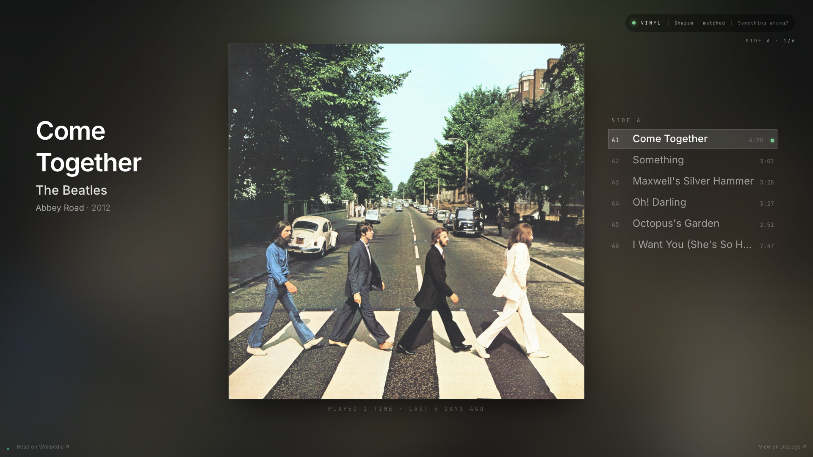
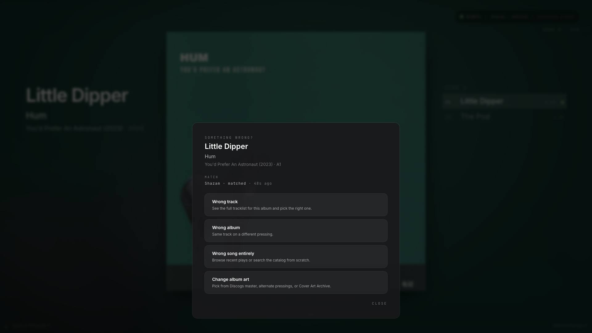
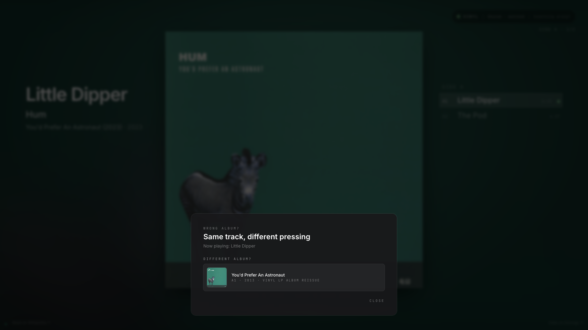
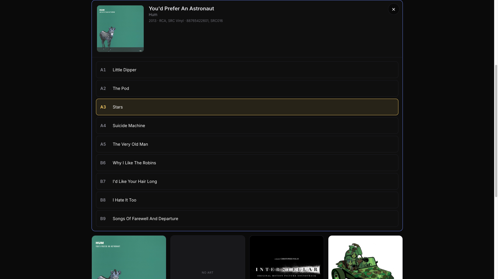
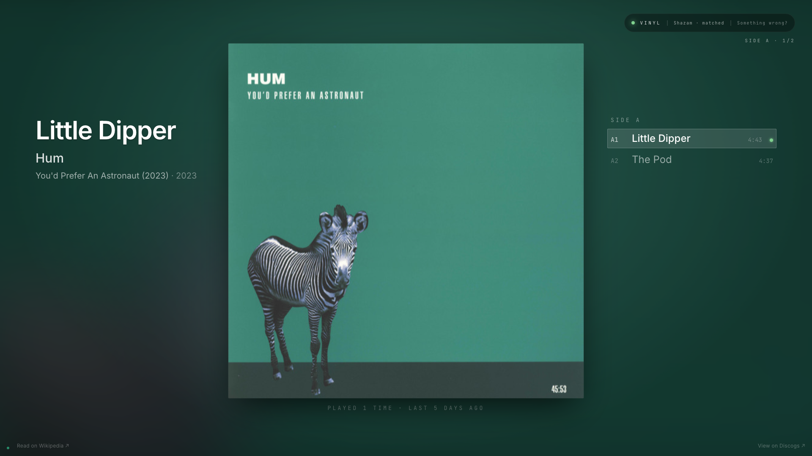
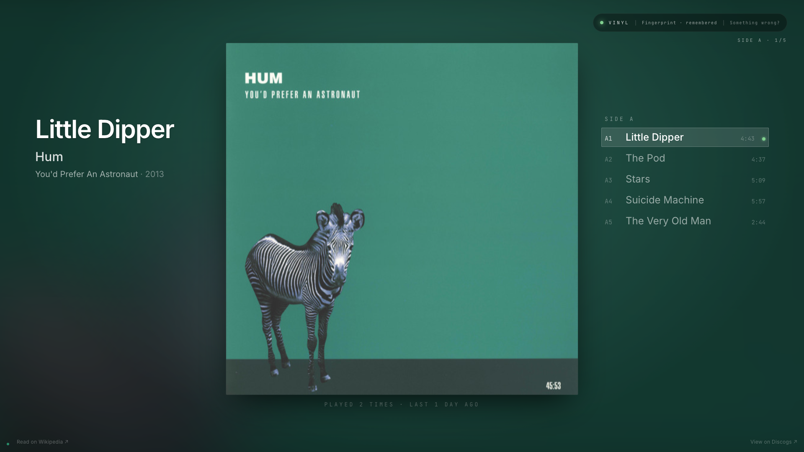

# Edge cases and how the kiosk handles them

Catalog and recognition edge cases observed on hardware, and how the cascade handles each.

If you hit a new edge case not listed here, open an issue or PR.

## J Dilla — *Donuts* and sample-source confusion

**What happens:** J Dilla's *Donuts* is built on dense sample manipulation. When you drop the needle, Shazam frequently returns the *sampled source* instead of the Dilla track. e.g., a clip from "Stop" can return the original Dionne Warwick recording; a clip from "Lightworks" can return the Raymond Scott jingle. The artist comes back wrong, the title comes back wrong, and a naive system would lock onto the wrong release.

**How the kiosk handles it:**

- **Cross-heartbeat agreement gate.** Shazam-only hits (where Discogs can't match the returned `(artist, title)` to anything in your collection) don't publish until ≥2 consecutive heartbeats agree on the same `(artist, title)`. Sample-source confusion tends to be inconsistent — different sample triggers per heartbeat — so most spurious hits never get past this gate.
- **Sticky-release bonus (+25 in disambiguation).** Once an album IS locked, subsequent heartbeats that return a wrong-but-confidently-different artist are penalized against the existing lock. The locked release wins ties.
- **Tracklist-aware advancement (predicted-position).** When Shazam stumbles, the orchestrator advances through the locked tracklist based on elapsed time and publishes a predicted track. Kiosk shows the right title even when Shazam returns nothing.
- **Local fingerprint cascade.** After a few confirmed plays, local fingerprint refs are promoted for each track. The next play matches locally, bypassing Shazam entirely — so the sample-source confusion stops being a problem.

**Open follow-up:** the LLM-judged shazam-relevance hook (env-gated on `ANTHROPIC_API_KEY`) is designed for exactly this — read a cross-album Shazam hit and decide whether to accept or reject. Without it, the cross-heartbeat agreement gate is doing the work.

## Beatles — same track across many releases

**What happens:** "Hey Jude" appears on:
- the 1968 single (Apple R 5722)
- *Hey Jude* (1970 US compilation, Apple SW-385)
- *1967-1970* (the Blue Album, 1973)
- *Past Masters Volume 2* (1988 compilation of non-album singles)
- *The Beatles 1* (2000 compilation)
- *Anthology 3* (1996 — alt take)
- various anniversary remasters

If you own three or four of these, Shazam's title hit produces a `(artist="The Beatles", title="Hey Jude")` lookup that matches **every one of them** in your Discogs collection.

**How the kiosk handles it:**

- **Sticky-release bonus (+25).** If you JUST played another track from one of these albums, that release wins the next ambiguous lookup.
- **Side-first bonus (+15).** "Come Together" is A1 on Abbey Road but D2 / R2 on compilations (see the Come Together example below). The A1 release gets a small nudge that disambiguates equally-scored candidates.
- **Vinyl-format bonus (+5).** Vinyl pressings outrank CD-only releases in the catalog.
- **Compilation penalty (-3).** Comps get a small downvote so original-pressing wins ties.
- **"Wrong album" pin.** If the cascade picks wrong (e.g., it locked onto *Past Masters* but you actually have *The Beatles 1967-1970* on the turntable), tap **Something wrong? → Wrong track** on the kiosk. Pick the right release from your collection; the pin sticks for the rest of the play.

**Concrete example — *Come Together*.** A catalog with three Beatles releases containing "Come Together" (or its normalized equivalent):

| release_id | year | position | release |
|---|---|---|---|
| **4042258** ← PICKED | 2012 | **A1** | Abbey Road |
| 28859359 | 2023 | D2 | 1967-1970 (Blue Album) |
| 35721814 | 2025 | R2 | Anthology Collection |

The cascade picked Abbey Road because Come Together sits at A1 on the original LP (`+15` side-first) but at D2 / R2 on the compilations, and both compilations carry the `-3` compilation penalty. Normalization also strips parentheticals — the Blue Album entry is technically titled `"Come Together (2019 Mix)"` in Discogs, but the cascade matches on the normalized form. The kiosk renders Abbey Road's crosswalk cover, not the Blue Album or Anthology art:

## American Football — four eponymous LPs

**What happens:** American Football's four LPs are all canonically titled "American Football". Disambiguation picks the right `release_id` (different `id`s in the catalog), but the published `album` field renders as the same string — "American Football" — for all four. The user sees identical album names for tracks from four different LPs.

**How the kiosk handles it:** the disambiguator detects when two or more releases by the same artist share the same canonical title and suffixes the published `album` field with the release year — the kiosk shows `"American Football (YYYY)"` with the year of each specific LP. The bare canonical title stays on the `title` column for `/identify` search; typing "American Football" still finds all four.

**Future:** when year alone is ambiguous (eponymous boxset reissues), the disambiguator falls back to catno.

## Hum — *You'd Prefer An Astronaut* with different tracks per side

**What happens:** Two pressings of the same album can have different tracks per side. The 2023 reissue of Hum's *You'd Prefer An Astronaut* splits the tracklist across 2 LPs (~2 tracks per side); the 2013 reissue presses the whole thing on a single LP (~5 tracks per side). Same album, same audio, but the side timer and the tracklist panel render completely differently depending on which pressing the cascade picks.

If the cascade picks the wrong one (e.g., locks onto the 2023 reissue when you're playing the 2013), the kiosk shows the wrong tracklist on the right column even though the current track is correct. The artist + title + album-art are all fine — just the *side layout* is wrong.

**How the kiosk handles it:** the `Something wrong? → Wrong album` flow on the kiosk surfaces the catalog's alternate pressings as taps. Below: the menu (left), the pressing chooser (right), and the kiosk after pinning the correct pressing.

(If the artist + album is right but the *track* identification is wrong, the **Wrong track** option opens a full tracklist picker for the locked album — useful when Shazam guesses the wrong song from your album:)

After tapping the correct pressing, the orchestrator's `user_track_pin` honors the choice for the rest of the play. The tracklist panel re-renders with the right side layout and the side timer arithmetic uses the correct per-track durations.

| Wrong (2023, 2 tracks per side) | Right (2013, 5 tracks per side) |
|---|---|
|  |  |

## Failure — *Fantastic Planet* and Shazam catalog gaps

**What happens:** Some tracks on *Fantastic Planet* don't reliably hit in Shazam. Same gaps across pressings (the audio is identical to recognition).

**How the kiosk handles it:**

- **Discogs catalog enrichment.** Once any track on the album hits cleanly, the orchestrator locks onto the release. Subsequent tracks are recognized first by Shazam — if Shazam misses, the cascade falls through to:
- **Tracklist-aware advancement.** Predicted next track from the locked tracklist publishes with `match_method: "predicted"`. The kiosk renders it italic with a "Best Guess" card so you know it's not a confirmed match.
- **Local fingerprint cascade.** Each confirmed Shazam hit grows a local ref. After 2-3 full plays of the LP, Shazam misses on these tricky tracks are caught locally — the cascade matches `fingerprint: matched ... pos=B7 hits=12` and publishes the correct track without needing Shazam.

## Records not in your Discogs collection

**What happens:** You play a record you haven't synced (a recent purchase, a friend's loan, something off Discogs entirely). Shazam identifies the track but the local Discogs catalog returns no match.

**How the kiosk handles it:**

- **Shazam-only display.** First heartbeat publishes artist + title + album + cover art via Shazam's response payload. Kiosk shows a clean now-playing card — just no tracklist on the right.
- **MusicBrainz discovery.** A background MB lookup keyed on Shazam's ISRC (or `(artist, album)` fallback) resolves the album's full tracklist + durations and persists to `pi/data/discovered.sqlite`. Second heartbeat (~15-30s later) picks this up — the kiosk upgrades to the full album-locked display with tracklist + side timer + BEST GUESS card on Shazam misses.
- **MBID-keyed local fingerprint cascade.** Same promotion logic as Discogs-locked records, but keyed on the MusicBrainz release identifier instead of a Discogs release_id. Off-Discogs records build local fingerprint refs identically to your collection.

By the third play, an off-Discogs record behaves exactly like a synced one.

## Ambient noise crossing the silence floor

**What happens:** You're not playing anything but the kiosk briefly flashes from the clock to "Identifying record" then back. Recorded heartbeats show audio at -14.9 to -15.6 dB — right at the silence threshold.

**How the kiosk handles it:** the `SHAZAM_ONLY_MIN_LEVEL_DB` gate sits at -12 dB, so threshold-edge ambient noise (-14 to -16 dB on UFO202+preamp) doesn't count as "music level" and won't trigger a NEEDS_ID publish.

If you still see flapping, your preamp ambient is louder than expected — open an issue with a recent `journalctl -u nowplaying-orchestrator | grep capture` slice.

## How to add to this list

If you hit a new edge case:

1. Open an issue with the artist/album/track that surfaced it.
2. Include a `journalctl -u nowplaying-orchestrator --since "10 min ago"` slice covering the playback session.
3. Capture a kiosk screenshot if the display did something unexpected.
