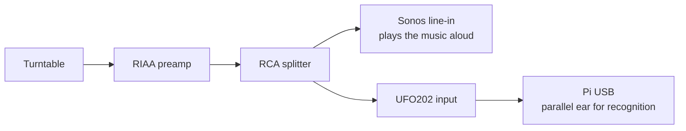

# Installing Now Playing

A step-by-step walkthrough for bringing up the Now Playing kiosk on your own Raspberry Pi. Aimed at technical users who are comfortable with SSH, Git, and basic Linux administration. Plan on **60–90 minutes** for a first install.

You don't need to memorize anything. The repo ships with a Claude Code skills bundle — see `.claude/skills/` — that activates as soon as you `cd` into the repo. When something doesn't work, ask Claude.

## Before you start

### Hardware

- **Raspberry Pi 4 or 5** with a 16 GB+ SD card.
- **Kiosk display** — anything HDMI- or DSI-attached works. AMOLED panels look the best (deep blacks make album art pop).
- **USB audio interface.** The project is built around the **Behringer UFO202**, which appears as a generic "USB Audio CODEC" device. Other stereo USB inputs will work — you may need to edit `pi/scripts/capture_proto.py:find_ufo202` to match your device name.
- **Sonos zone** connected to your turntable via line-in.
- **Turntable + RIAA pre-amp** feeding both the Sonos line-in and the UFO202 via a splitter.

### Accounts

- **Discogs** (recommended, free). You'll generate a personal access token from your account settings. The orchestrator runs without it — off-Discogs records are auto-discovered via MusicBrainz at recognition time and persisted to `discovered.sqlite` — but a synced Discogs catalog gives you your specific pressing's tracklist + cover scans and the `/identify` manual-pick flow against your collection.

### Skills

- Comfortable with SSH and a Linux command line.
- Can edit `.env` files and read `journalctl` output.
- Has Claude Code (or equivalent) installed locally — the project's `.claude/skills/` will help.

## Step 1: Wire the audio chain



The split is the key insight. Sonos handles playback for the room. The Pi listens to a parallel copy of the same signal and identifies the track from it. The kiosk publishes what's playing without ever touching Sonos audio routing.

## Step 2: Prepare the Pi

1. Flash **Pi OS Bookworm or later** (64-bit). [Raspberry Pi Imager](https://www.raspberrypi.com/software/) can pre-configure SSH, hostname, and timezone — use the customization options.

2. Set the hostname to **`nowplaying-pi`** (the convention this project follows). Confirm you can SSH in:

   ```bash
   ssh pi@nowplaying-pi.local
   ```

3. Install system dependencies:

   ```bash
   sudo apt update && sudo apt install -y git curl chromium
   ```

   On older Pi OS images (Bullseye and earlier), the package is `chromium-browser`. The systemd unit looks at `/usr/bin/chromium` — symlink if needed.

## Step 3: Clone the repo and create the venv

On the Pi:

```bash
git clone <repo-url> ~/now-playing
cd ~/now-playing/pi
curl -LsSf https://astral.sh/uv/install.sh | sh
exec $SHELL    # pick up uv on PATH
uv sync --extra audio --extra discogs --extra shazam
```

**Verify:** `uv run python -c "import sounddevice; print('ok')"` prints `ok` (from `~/now-playing/pi`).

## Step 4: Get a Discogs token and sync your catalog

> **Skip ahead if you want to try without Discogs first.** The orchestrator runs without `DISCOGS_TOKEN` — leave it out of `.env`, skip the `discogs_sync.py` step, and off-Discogs records will be auto-discovered via MusicBrainz on first play (persisted to `pi/data/discovered.sqlite`). You can sync Discogs later without reinstalling.

1. Generate a Discogs personal access token at <https://www.discogs.com/settings/developers> → **Generate new token**. Copy it.

2. Create `~/now-playing/pi/.env`:

   ```
   DISCOGS_TOKEN=your-personal-token
   SONOS_ZONE_NAME=Office          # change to your zone name
   ```

   See [External requirements](../README.md#external-requirements) and [`pi/.env.example`](../pi/.env.example) for the full list of optional keys you may want to add now (Last.fm scrobbling).

3. Run the sync (takes 5–20 minutes depending on collection size). Run from the `pi/` directory so `uv` finds `pyproject.toml`:

   ```bash
   cd ~/now-playing/pi
   uv run python scripts/discogs_sync.py
   ```

   The script runs three idempotent passes: basic release metadata, full tracklist details, and Discogs cover-image download (kept as a local cache; runtime album art is fetched live from MusicBrainz / Cover Art Archive). Re-runs skip what's already synced.

**Verify:** `ls -la pi/data/discogs.sqlite` shows a file of at least a few hundred KB.

## Step 5: Configure your Sonos zone

- Open the Sonos app, confirm the zone you wired to your turntable is named exactly what you put in `SONOS_ZONE_NAME` (case-sensitive).
- Set **Line-In** as the zone's playback source.
- **Network requirement:** the Pi must be on the same VLAN as your Sonos system. UPnP multicast doesn't cross VLANs by default, so isolated IoT VLANs will block zone discovery. Some managed switches also filter SSDP/UPnP traffic even within a VLAN — if zone discovery fails on the same subnet, check switch settings.

**Verify:** from the Pi, `ping <sonos-ip-of-the-zone>` succeeds.

## Step 6: Verify the audio capture pipeline manually

Before installing the service, run capture once interactively to confirm the audio chain is wired correctly. Run from the `pi/` directory:

```bash
cd ~/now-playing/pi
uv run python scripts/capture_proto.py
```

Drop a needle on a record. Within 15 seconds you should see JSON lines on stdout like:

```
{"ts":"2026-05-11T13:00:00Z","event":"started","device":"USB Audio CODEC: - (hw:3,0)","silence_db":-15.0,"heartbeat_s":15.0}
{"ts":"2026-05-11T13:00:15Z","event":"heartbeat","level_db":-4.2,"clip":"pi/data/clips/...","clip_seconds":10.0}
```

**Sanity check:** `level_db` during music should sit around **-10 to -1 dB** (ambient line-in with no record playing sits near -17 dB; the silence floor is -15 dB). If `level_db` during music is below -15 dB the input gain is too low — check your pre-amp output and the UFO202's input level switch.

Ctrl+C to stop.

## Step 7: Install the systemd services

```bash
cd ~/now-playing
sudo bash pi/systemd/install.sh
```

The installer:

- Detects the running user via `$SUDO_USER` (override with `NOWPLAYING_USER=<name>`).
- Substitutes the user + home directory into the unit templates.
- Installs `nowplaying-orchestrator.service` and `nowplaying-kiosk.service` into `/etc/systemd/system/`.
- Enables and starts both.

**Verify:**

```bash
systemctl is-active nowplaying-orchestrator
journalctl -u nowplaying-orchestrator -n 30 --no-pager
```

Expected: `active`, with recent log lines including `capture started: ... silence_db=-15.0 heartbeat_s=15.0`.

### Boot timing and USB audio

On a cold reboot the USB Audio CODEC (UFO202) takes a few seconds longer to be enumerated by ALSA than it takes the orchestrator to start. The service file declares `After=sound.target Wants=sound.target` as a best-effort ordering hint, but `sound.target` does not reliably fire for USB audio devices.

As a second layer of protection, `capture_proto.py` retries the device-open call with exponential back-off (1 s → 2 s → 5 s → 10 s, capped at 10 s) for up to ~30 s before giving up. Each retry attempt is logged to the systemd journal:

```
[capture] device not found (attempt 1, elapsed 0.0s); retrying in 1s …
[capture] device not found (attempt 2, elapsed 1.1s); retrying in 2s …
[capture] device [3] USB Audio CODEC: - (hw:3,0) rate=44100
```

In practice the CODEC appears within 3–5 s of orchestrator start on a Pi 4, so recognition is online within ~30 s of boot without manual intervention.

### A note on Wayland vs X11

Pi OS Bookworm defaults to **Wayland** on Pi 4/5. The kiosk unit sets `DISPLAY=:0` and `XAUTHORITY=$HOME/.Xauthority`, which work via XWayland but assume a standard Pi OS Desktop session. If you've reconfigured your Pi to use a pure Wayland compositor without XWayland, you may need to adjust the unit's `[Service]` block (e.g. `WAYLAND_DISPLAY=wayland-0` and removing `DISPLAY`).

For the default Desktop install of Bookworm: no changes needed.

## Step 8: Open the kiosk

From any device on the LAN:

```
http://nowplaying-pi.local:8080/
```

If the kiosk display is attached to the Pi and a graphical session is running, Chromium auto-launches against this URL on boot (the kiosk unit waits for `/health` before opening the browser, so no race condition with the orchestrator).

- **When a record plays:** the display updates within ~15 seconds (one heartbeat).
- **When the record stops:** the display reverts to a clock after ~50 seconds (5s silence detection + 45s idle timer).

## Optional: Waveshare 13.3" FHD AMOLED Touch Display

If you're using the [Waveshare 13.3" FHD AMOLED Touch Display](https://www.waveshare.com/wiki/13.3inch_FHD_AMOLED_Touch_Display) (1920×1080, capacitive touch), there is one hardware step required before touch input works in the kiosk.

### The display has two cables, not one

The touch controller is exposed as a **separate USB HID device** independent of the HDMI video cable. You need both connected:

| Cable | Purpose | Port on display |
|---|---|---|
| HDMI | Video output | HDMI port |
| USB-A to USB-A (or USB-A to USB-C) | Touch input | "Touch" USB port |

Connect the touch USB cable from the display's "Touch" port to any USB-A port on the Pi. If the cable wasn't in the box, any USB-A to USB-A or USB-A to USB-C cable works.

### Verify touch is enumerated

After connecting the USB cable, confirm the kernel sees the device:

```bash
lsusb
# A new HID device should appear that wasn't there before

sudo libinput list-devices | grep -A5 -i touch
# Should show a device with "Capabilities: touch"

cat /proc/bus/input/devices | grep -B1 -A8 -i touch
# Should show an event node with EV=b (absolute touch events)
```

Verify the udev touch property is set (required for libinput quirks):

```bash
udevadm info /dev/input/event<N> | grep ID_INPUT_TOUCHSCREEN
# Expected: ID_INPUT_TOUCHSCREEN=1
```

Test raw touch events fire:

```bash
sudo libinput debug-events --device /dev/input/event<N>
# Tap the screen — expect TOUCH_DOWN / TOUCH_UP lines
```

If the touch device appears in `lsusb` but no event node shows in `libinput list-devices`, check whether the `hid_multitouch` kernel module loaded:

```bash
lsmod | grep hid_multitouch
```

If absent, load it and persist it:

```bash
sudo modprobe hid_multitouch
echo "hid_multitouch" | sudo tee -a /etc/modules
```

On Pi OS Trixie with kernel 6.12.x, this module loads automatically for USB HID devices advertising a digitizer usage page. Manual loading is only needed for unusual panel variants where udev doesn't auto-attach the driver.

### Chromium touch flags

The kiosk service (`pi/systemd/nowplaying-kiosk.service`) already includes the required Chromium flags:

```
--touch-events=enabled
--enable-touch-drag-drop
```

These are set in the service template; no manual action needed. Re-run `sudo bash pi/systemd/install.sh` after any pull that updates the service file to apply changes.

If touch fires in `libinput debug-events` but not in Chromium (rare, seen when multiple input devices are present), add the `--touch-devices` flag pointing to the specific input device. Prefer the stable `/dev/input/by-id/` or `/dev/input/by-path/` symlinks over `/dev/input/event<N>` — event numbers can change between reboots if USB devices enumerate in a different order:

```bash
# Find the stable symlink:
ls -la /dev/input/by-id/ | grep -v mouse | grep -v kbd

# Then in the ExecStart line of the service:
--touch-devices=/dev/input/by-id/usb-<vendor>_<product>-event-if00
```

Re-run `sudo bash pi/systemd/install.sh` after editing the service file.

### Calibration (if tap targets are off)

With the display at its native resolution the touch digitizer should map correctly. If taps consistently miss by more than ~10px, apply a libinput calibration matrix:

1. Find the device name: `sudo libinput list-devices | grep -A2 -i touch` — note the `Device:` line.

2. Create `/etc/libinput/local-overrides.quirks`:

   ```ini
   [Waveshare 13.3" FHD AMOLED Touch]
   MatchUdevType=touchscreen
   MatchName=*Waveshare*
   AttrCalibrationMatrix=1.0 0.0 0.0 0.0 1.0 0.0 0.0 0.0 1.0
   ```

   Update `MatchName` to match the actual device name if it differs (common values: `*Goodix*`, `*ILITEK*`). The identity matrix above is the no-correction baseline. Adjust the two translation coefficients (positions [0][2] and [1][2] in the matrix) based on measured offsets from `sudo libinput debug-events`.

3. Restart the compositor session (reboot or log out/in) for the quirk to take effect.

## Optional: Last.fm scrobbling

Auto-scrobble confirmed tracks (≥30s duration, played for ≥50% or ≥240s) to your Last.fm profile.

**What you lose without it:** nothing the kiosk surfaces — Last.fm activity is independent of recognition. The kiosk runs identically; nothing is sent to Last.fm.

1. Create an API account at <https://www.last.fm/api/account/create>. You'll receive an **API key** and **API secret**.

2. Bootstrap a session key (one-time, requires you to authorize the app in a browser):

   ```bash
   cd ~/now-playing/pi
   export LASTFM_API_KEY=your-api-key
   export LASTFM_API_SECRET=your-api-secret
   uv run python scripts/lastfm_auth.py
   ```

   Follow the prompted URL in a browser, click Yes, then return to the terminal. The script prints a `LASTFM_SESSION_KEY` value.

3. Add all three to `~/now-playing/pi/.env`:

   ```
   LASTFM_API_KEY=your-api-key
   LASTFM_API_SECRET=your-api-secret
   LASTFM_SESSION_KEY=the-session-key-from-step-2
   ```

   No `uv` extra needed — Last.fm support uses the existing `aiohttp` dependency.

4. Restart the orchestrator: `sudo systemctl restart nowplaying-orchestrator`.

5. **Verify** on the next confirmed track that crosses the threshold:

   ```bash
   journalctl -u nowplaying-orchestrator | grep -i scrobbled
   ```

   Expect a `Scrobbled to Last.fm: <Artist> — <Title>` line (emitted by `pi/nowplaying/scrobble.py:160`).

## Optional: Local fingerprint fallback

When Shazam misses on a record you've already played a few times, the orchestrator can identify the track from a **local fingerprint DB** that grows automatically with each confirmed Shazam hit. After a few plays of an album, Shazam's catalog gaps stop showing up on the kiosk. The fingerprint DB grows for both Discogs-synced releases and MusicBrainz-discovered ones, so the cascade applies whether or not you own a record in your Discogs collection.

**What you lose without it:** Shazam misses on a locked album fall through to tracklist-aware advancement — the orchestrator predicts the next track by elapsed side time rather than by audio match. The kiosk works identically; predictions just aren't audio-grounded.

1. In `~/now-playing/pi/.env`:

   ```
   FINGERPRINT_ENABLED=true
   ```

2. Install the optional extra (include all previously installed extras — `uv sync` is declarative):

   ```bash
   cd ~/now-playing/pi
   uv sync --extra audio --extra discogs --extra shazam --extra fingerprint
   sudo systemctl restart nowplaying-orchestrator
   ```

3. **Verify** the cascade activated at boot:

   ```bash
   journalctl -u nowplaying-orchestrator | grep "features:"
   ```

   Expect `features: fingerprint=on ...` in the boot output.

4. After playing a record once or twice, **verify** refs are being promoted:

   ```bash
   sqlite3 ~/now-playing/pi/data/fingerprint.db 'SELECT release_id, track_position, track_position_s FROM fp_refs ORDER BY created_at DESC LIMIT 10'
   ```

5. On a subsequent play, when Shazam misses a track and the local DB hits, the kiosk's source badge shows `· fingerprint`:

   ```bash
   journalctl -u nowplaying-orchestrator | grep "fingerprint: matched"
   ```

## When things go wrong

Ask Claude. The repo ships with skills that activate on natural phrasing:

- **"Help me set this up"** → `nowplaying-setup` walks you through this exact guide interactively.
- **"The orchestrator service won't start"** → `nowplaying-troubleshoot` diagnoses systematically.
- **"What's playing right now?"** → `nowplaying-status` queries the WebSocket and reports.
- **"Show me recent recognitions"** → `nowplaying-diagnose` does read-only inspection.

See `.claude/skills/README.md` for the full list. For annotated journalctl excerpts showing what a healthy system looks like in flight, see [`docs/example-logs.md`](example-logs.md).

### Quick reference for common issues

| Symptom | Likely cause | Where to look |
|---|---|---|
| Service won't start | venv path wrong, Python deps missing | `journalctl -u nowplaying-orchestrator -n 50` |
| Kiosk shows clock while record plays | Audio chain not detected | Re-run Step 6 manually |
| Kiosk shows wrong track | Shazam false positive, or stale `last_vinyl` | `sudo systemctl restart nowplaying-orchestrator` |
| Sonos zone not discovered | Wrong zone name, or VLAN routing | Confirm `SONOS_ZONE_NAME` matches the app exactly |
| `level_db` < -15 dB during music | Input gain too low (at or below the silence floor) | Check pre-amp, UFO202 input switch |

## What ships with the repo

| Path | Purpose |
|---|---|
| `pi/` | Python orchestrator (Sonos listener + audio capture + recognition + WebSocket server) |
| `kiosk/` | React + Vite display, served by the orchestrator's HTTP server |
| `pi/systemd/` | Service unit templates + installer script |
| `.claude/skills/` | Project-local Claude Code skills bundle |
| `docs/ARCHITECTURE.md` | Technical reference for every mechanism in the pipeline |

Good luck. If you get stuck, ask Claude — and if Claude gets stuck, file an issue with the relevant `journalctl` output.
