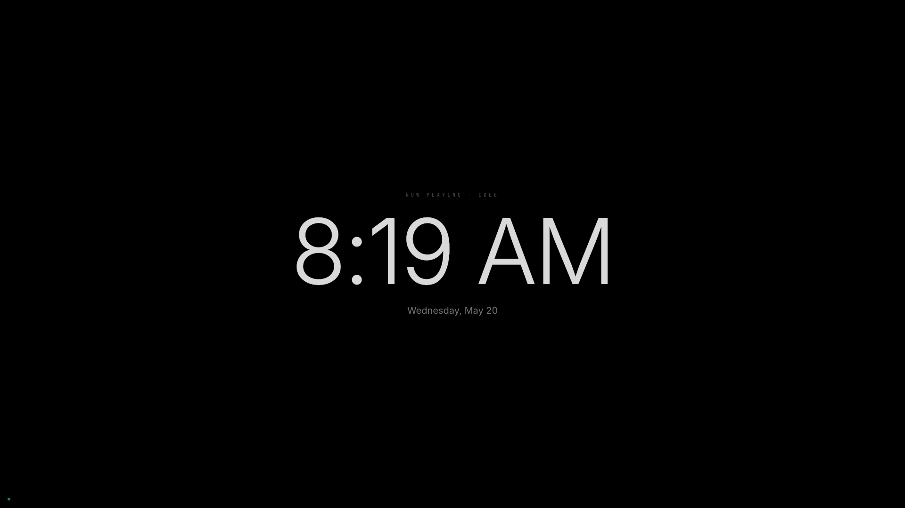
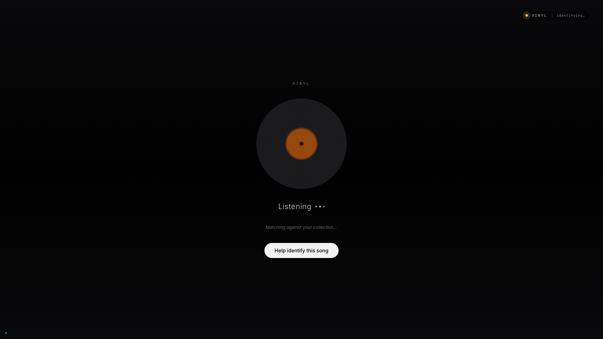
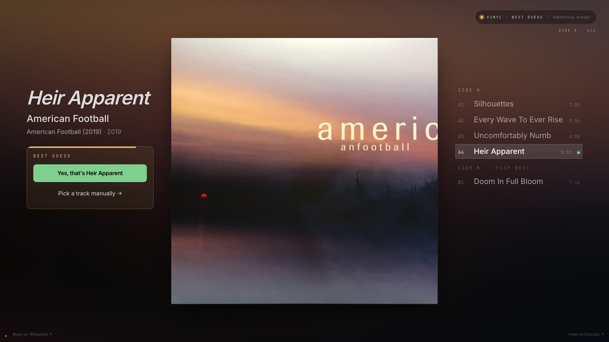
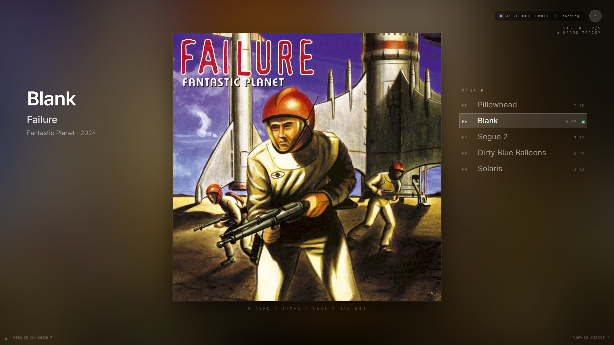
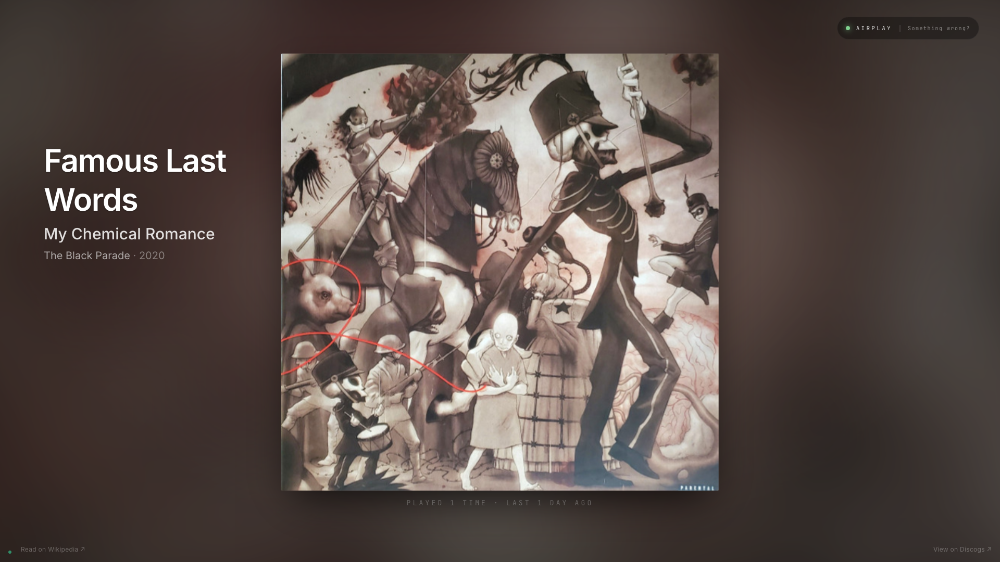
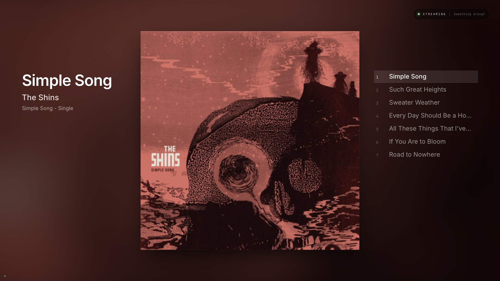

# Using the Now Playing kiosk

A guide for the person standing in front of the display with a record on the turntable. If you're installing the system from scratch, start with [INSTALL.md](INSTALL.md) instead.

## The short version

Drop a needle. The display will show what's playing within ~15 seconds. Most of the time, that's all you need to do.

Some records will need one tap from you when a track changes — the system asks "Yes, that's [track name]?" and you confirm. The next time you play that same record, it won't ask again. **The kiosk gets smarter the more you play.**

## What you see on the screen

The kiosk has six visible states. You will encounter all of them.

### 1. Idle clock

What it means: no audio detected, no record on the turntable (or volume too low).

What to do: drop a needle.

### 2. Identifying record

What it means: audio is live and the system is trying to figure out what it is. This happens for ~15-45 seconds when you first drop a needle on a new record.

What to do: wait. Don't tap the "Help identify this song" button unless the system stays on this screen for longer than ~45 seconds.

### 3. Track confirmed by Shazam

What it means: Shazam identified the track. This is the steady state.

What to do: nothing. Enjoy.

### 4. Best Guess card (predicted track)

What it means: Shazam couldn't identify what's playing, but the system knows what album is on the turntable and has guessed the next track from the tracklist. The italic title is the visual cue for "we're guessing."

What to do:
- **If the guess is correct** (it usually is): tap "Yes, that's [track]". The kiosk locks in that track and starts learning the audio so it won't need to ask next time.
- **If the guess is wrong**: tap "Pick a track manually →" — you'll see the tracklist and can tap the right one.
- **If you do nothing**: the orange drain bar at the top of the card empties over 60 seconds. After that the system gives up on the guess and goes back to "Identifying."

The drain bar is the time pressure cue. You don't need to tap immediately — you have a full minute to read it.

### 5. Just confirmed

What it means: you just tapped Yes. The system is now building fingerprints for this track in the background — every 15 seconds of audio gets fingerprinted and stored, labeled with this track.

What to do: nothing. The "learning..." pill fades out after a moment; the kiosk returns to a normal confirmed-track view.

### 6. Confirmed via fingerprint

What it means: a previous play of this record taught the system what this track sounds like. Shazam might still miss it, but the local fingerprint database recognized it directly — no tap needed. The status pill shows `VINYL · Fingerprint · remembered` instead of `VINYL · Shazam · matched`.

What to do: nothing. This is the system rewarding you for past taps.

## The bootstrap journey

Here's what playing a brand-new record looks like over time.

### First play

| Track | What happens |
|---|---|
| B5 Pillowhead | Shazam identifies it (~5 seconds). ✓ confirmed. |
| B6 Blank | Shazam misses → predicted to "Blank" → **Best Guess card appears** → you tap Yes |
| B7 Segue 2 | Shazam misses → predicted to "Segue 2" → **Best Guess card appears** → you tap Yes |
| B8 Dirty Blue Balloons | Shazam identifies it. ✓ confirmed. |
| B9 Solaris | Shazam misses → predicted to "Solaris" → **Best Guess card appears** → you tap Yes |

Three taps for the full side. The taps are quick — read the card, tap Yes if correct.

### Second play of the same record

| Track | What happens |
|---|---|
| B5 Pillowhead | Shazam identifies it. ✓ |
| B6 Blank | Shazam misses → **Fingerprint matches** (from your first play). ✓ no tap needed. |
| B7 Segue 2 | Shazam misses → **Fingerprint matches**. ✓ |
| B8 Dirty Blue Balloons | Shazam identifies it. ✓ |
| B9 Solaris | Shazam misses → **Fingerprint matches**. ✓ |

Zero taps. The cascade graduated.

The same pattern applies to every new record you play. The first time you play a record, expect a few taps. After that, the system handles it.

## First play without Discogs

Records that aren't in your Discogs collection (or if you skipped the Discogs sync entirely) take one extra heartbeat to come up to full fidelity. On the first heartbeat after the needle drops you'll see a Shazam-only display — artist, title, album, and cover art from Shazam's Apple CDN — without the side tracklist on the right. ~15–30 seconds later, once the background MusicBrainz lookup completes and the release is persisted to `discovered.sqlite`, the kiosk upgrades to the full album-locked display with tracklist, side timer, and BEST GUESS behavior.

From the second play onward the album is already cached locally, so there's no upgrade lag — the record behaves identically to one synced from Discogs, including the fingerprint cascade rewarding past taps.

## When you're not on vinyl — AirPlay and Sonos streaming

The kiosk follows whatever your Sonos zone is doing. Switch the zone from Line-In to something else and the kiosk follows:

- **AirPlay (no embedded metadata)** — e.g., audio from an iPhone, Mac, or other AirPlay sender that doesn't broadcast track info. The kiosk listens through the same UFO202 + Shazam path it uses for vinyl, so you still get artist + title + album + tracklist when Shazam recognizes the audio. Useful when a guest pipes a playlist through to your Sonos.
- **AirPlay with metadata** (e.g., Apple Music via AirPlay) or **Sonos-native streaming** (Spotify Connect, Apple Music in the Sonos app, internet radio with track tags) — the kiosk renders artist / album / cover art straight from what Sonos already tells it. Audio recognition is skipped because the streamer is the source of truth.
- **Sonos radio / TV mode** — kiosk shows whatever Sonos surfaces (station name, show title); minimal info.

The status pill at the top right always tells you which source is live: `VINYL`, `AIRPLAY`, `STREAMING`, etc.

## Common situations

### "It's showing the wrong track"

Tap **Something wrong?** (the segment to the right of the status pill). Pick **Wrong track** from the sheet — you'll be taken to the manual identify flow where you can pick the right track from the tracklist. The wrong track's recent fingerprints get flagged and won't be trusted next time.

### "It's stuck on 'Identifying record'"

Two possibilities:

- **The track is genuinely silent** (between tracks, very quiet passage) — wait. The system will pick up when audio resumes.
- **Shazam can't catalog this audio AND it's a track we haven't taught the system yet** — tap "Help identify this song" to manually pick from the tracklist.

### "The display says one track but I'm hearing another"

Most likely cause: a wrong tap earlier in the session pinned the wrong track. Tap **Something wrong?** → **Wrong track** and pick the correct one.

If this happens repeatedly: the system's idea of which album is on the turntable might be wrong. Lift the needle for ~3 minutes (the kiosk will go idle), then drop it again. Idle reset clears the album lock so identification starts fresh.

### "The kiosk briefly went to 'Identifying' between tracks"

Should rarely happen on records the system has seen before. If it does, the upcoming track wasn't yet in the fingerprint database — the next tap will fix it for future plays.

### "I dropped a different record but the kiosk still shows the old one"

Wait one heartbeat (~15 seconds). The cascade needs one capture cycle to notice the audio doesn't match the locked album, then it re-locks on the new album.

### "Album art looks wrong"

Tap **Something wrong?** → **Change album art**. You can pick from alternative covers fetched from your Discogs + MusicBrainz / Cover Art Archive; your override is remembered for this release on this kiosk.

## What NOT to do

- **Don't tap the BEST GUESS card if you don't know the answer.** Tap "Pick a track manually" instead — that route is designed to handle uncertainty. A wrong "Yes, that's X" tap poisons the local fingerprint database with audio labeled as the wrong track, and that takes future plays to recover from.

- **Don't drop a new record before the previous one is fully off the platter.** The cascade can get confused if it captures mid-transition audio while the album lock is still on the previous record. Lift fully, wait 5 seconds, then drop the new one.

- **Don't tap rapidly through multiple BEST GUESS cards.** Each tap commits a track and starts fingerprint promotion. Read the card, tap once, wait for the "Just Confirmed" state to clear before considering the next.

## The big idea

The kiosk has three layers of recognition, in order:

1. **Shazam** (cloud) — recognizes well-cataloged tracks instantly. Has occasional gaps.
2. **Local fingerprints** — learned from your past confirmations. Recognizes anything you've taught it, in under a second.
3. **Predicted advance** (album-lock + tracklist) — when both fail, the system uses album context to guess "you just heard track 2 of side B, you're probably on track 3 now" and offers the BEST GUESS card.

Your taps on the BEST GUESS card train layer 2. Every tap makes layer 3 less necessary on future plays. The first play of any record is the most interactive; the second is the easiest; the tenth requires nothing.

The system is designed to **ask for your help only when it needs it**, and to **remember the answer** so it stops asking.

## Related

- [README.md](../README.md) — what this project is, hardware bill of materials
- [INSTALL.md](INSTALL.md) — first-time setup walkthrough
- [ARCHITECTURE.md](ARCHITECTURE.md) — technical reference for every mechanism
